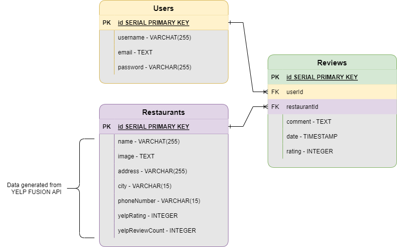

# GitRamenVancouver

## Pitch
GitRamenVancouver is an exclusive webapp for ramen connoisseurs that allows logged-in users to rate and review the top ramen restaurants in the greater Vancouver area. Our site offers detailed information regarding the top rated ramen restaurants in the city as well as the opportunity for users to post their opiniona and give a personally rating for each restaurant. Our site offers an average rating of all reviews which in turn provides users will top notch recommendations. What sets us apart from YELP and Google is that we vet users to ensure only the most high brow ramen aficionados are eledigle to rate and voice their opinion by tesing each user's ramen knowledge before allowing them access.
Our hopes for this web app is to develop a web-home for Ramen lovers and provide a reliable resource for those looking to determine where to find the best ramen in the city.


## API Choice

### YELP FUSION
YELPs API 'yelp fusion' provides access to any establishedment on YELP with a minumum of 1 review. I plan to use a query search to extract data with a location of VANCOUVER and a keyword of RAMEN. 
In order to access this data, I am required to request an access key and send that access key at each GET request via the header. 

I plan to use the AXIOS npm to make that request and receive a JSON payload and the DOTENV npm to keep my accesscode proviate.
See example code below: 
```
app.get('/', (req, res)=>{

    const url = `https://api.yelp.com/v3/businesses/search?location=vancouver&categories=ramen`
    const header = {headers: {Authorization: 'Bearer ' + process.env.YELP_ACCESS}}
    axios.get(url, header)
  .then(function (response) {
    // handle success
    res.send(response.data);
  })
  .catch (error){
      console.log(error)
  }
})
```

#### API Data I will be extracting

- name
- image
- review count
- rating
- pricing
- address (Street)
- address (City)
- phone number


## Entity Relationship Diagram



## RESTful Routing Chart

| Method | Path | Purpose |
| ------ | -------------- | -------------------------------- |
| GET | `/` | home page that allows user to sign in or sends user to create an account |
| GET | `/signup` | sign up page to allow user access to the site |
| POST | `/` | user signs in and gets redirected to `GET /restaurants/index`  |
| POST | `/signup` | creates a new user, then redirects back to `GET /` to login |
| GET | `/restaurant/index` | page that shows all restaurants in the database |
| GET | `/restaurant/logout` | allows the user to log out, then redirects back to `GET /` |
| GET | `/restaurant/:id` | page that shows a specific restaurant where users can review/rate |
| POST | `/restaurant/:id/review` | creates a review, the user always stays on `GET /restaurant/"id` |
| PUT | `/restaurant/:id/review` | user can update one of their reviews, the user always stays on `GET /restaurant/"id` |
| DELETE | `/restaurant/:id/review` | user can delete one of their reviews, the user always stays on `GET /restaurant/"id` |

## Wireframes

I chose to use [Figma](https://www.figma.com/) to create my wireframes. Please see the link below for a flow chart and/or the screenshots of that flow chart.

[Click here to see my flow chart on figma](https://www.figma.com/file/LrwZ9c6aqCjKA996gKSi7b/jamel?node-id=0%3A1)

### screenshots from figma


## User Stories

* As a user, I want to sign up or create an account.
* as a user, I want to see a list of the highest rated Ramen restaurants in the city.
* as a user, I want to provide a personally rating for these restaurants.
* As a user, I want to provide my own feedback and share experiences I've had at these restaurants.
* As a user, I want to be able to log out to avoid any other people posting on my computer on my behalf.

## MVP goals

- [x] Build a Sequelize model/SQL database of users that can be accessed to create and log-in users.
- [x] Generate between 6-20 ramen of the top rated ramen restaurants from YELP FUSION api and display them in a card-like format.
- [x] allow users to select a specific restaurant and display detailed information about that restaurant such as address, phone number, total reviews, average rating and pricing.
- [x] allow users to create, update and/or delete any number of reviews that they've posted.

## Stretch goals
- [x] add styling that includes drop shadows, hover, images/emojis for star ratings and error effects.
- [x] allow user rating to be displayed as a star emoji instead of an integer.
- [] allow users to upvote or "like" restaurants on the index page and have those restaurants displayed in chronological order based on likes.
- [] allow users to input their own restaurants and allow the same functionality to include reviews/rating with those restaurants OR build in a form that allows logged in users to submit a request for a restaurant to be included in the index.


<!-- Restaurant -->
models.restaurant.hasMany(models.review)
<!-- reviews -->
models.review.belongsTo(models.restaurant)
models.review.belongsTo(models.user)
<!-- users -->
models.user.hasMany(models.review)

<!-- config.json -->
{
  "development": {
    "username": "root",
    "password": "password",
    "database": "gitramen",
    "host": "127.0.0.1",
    "dialect": "postgresql"
  }
}
